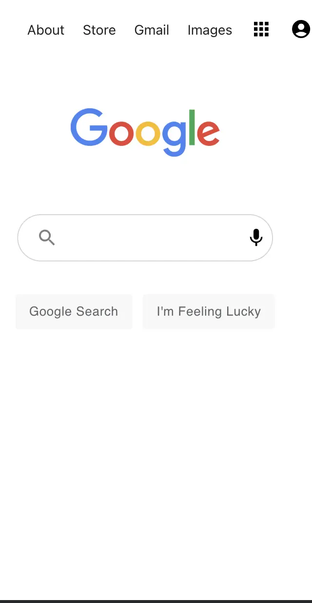
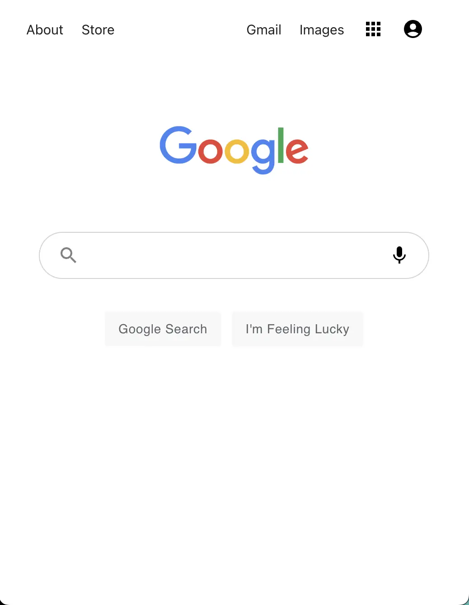
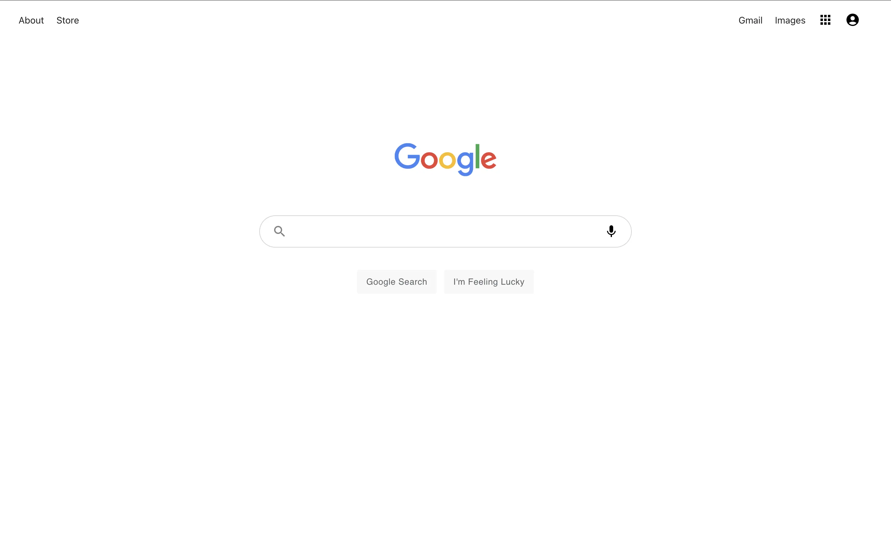
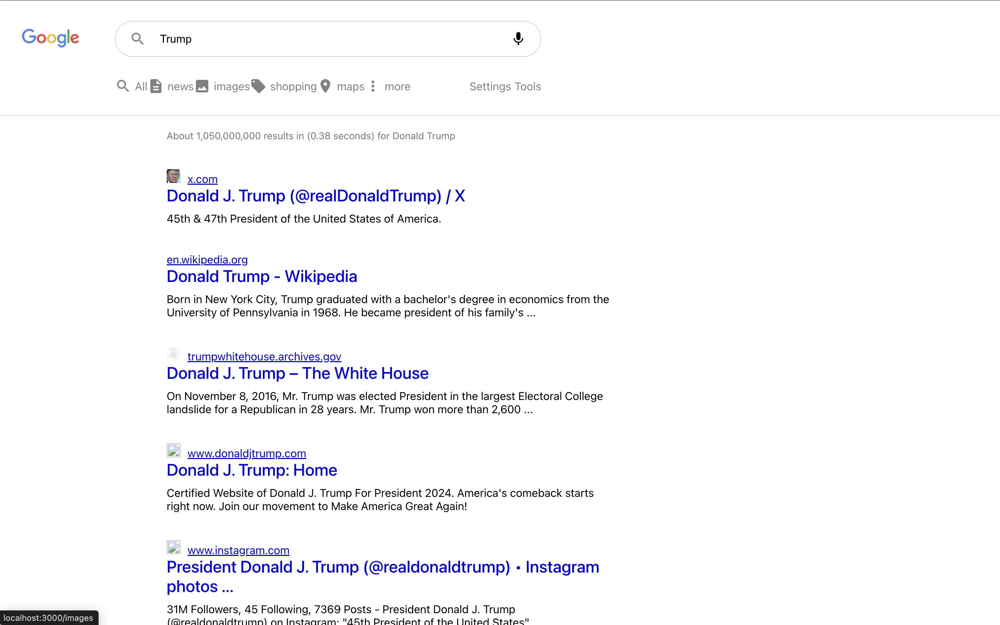

## GOOGLE CLONE 🔍

A sleek and responsive Google Search Clone built with ReactJS, leveraging the Context API for state management and the Google Custom Search API for fetching real-time search results. 

This project mimics the core functionalities of Google's search engine, delivering fast and accurate search results with a clean, user-friendly UI.

## 🚀 Features
- ✅ Real-time Search – Fetch results dynamically using the Google Custom Search API.
- ✅ React Context API – Efficient global state management without prop drilling.
- ✅ REST API Integration – Retrieve search results via Google's Custom Search JSON API.
- ✅ Responsive Design – Fully optimized for desktop and mobile devices.

## Responsive Design
### Landing Page

|  | |  | 
|:---:|:---:|:---:|
| Mobile view | Tablet view | Laptop view |

### The Search Page



## 🛠️ Tech Stack
- ReactJS – Frontend framework for building UI components.
- Context API – State management for handling search queries.
- Google Custom Search API – Fetching search results dynamically.
- React Router – Navigation between pages.
- Material UI – Styled components

## Instructions
To get a local copy up and running follow these simple example steps.

### Prerequisites
- Gitbash installed to navigate between the branches.
- A preferred text editor for example VS Code.
- A browser such as Google Chrome

### 🔧 Installation and Setup
1. Clone this [GitHub Repo](https://github.com/KabohaJeanMark/google-clone/) to your computer on yourFolder by typing these commands in the terminal or download as a Zip file and extract.
```bash
git clone https://github.com/KabohaJeanMark/google-clone/
cd google-clone
```

2. Install dependencies
```bash
npm install
```
3️. Set up your Google API Key

- Go to Google Custom Search.
- Generate an API Key and Search Engine ID.
- Create a .env file and add:
```bash
REACT_APP_GOOGLE_API_KEY=your_google_api_key
REACT_APP_SEARCH_ENGINE_ID=your_search_engine_id
```
4. Run the application
```bash
npm start
```

## 🎯 Future Improvements
- 📌 Voice search integration.
- 📌 Trending searches display.
- 📌 Improved search filtering options.

## 🤝 Contributing
Contributions are welcome! Feel free to fork the repo, make improvements, and submit a pull request.


## Show your support
Give a ⭐️ if you like this project!
